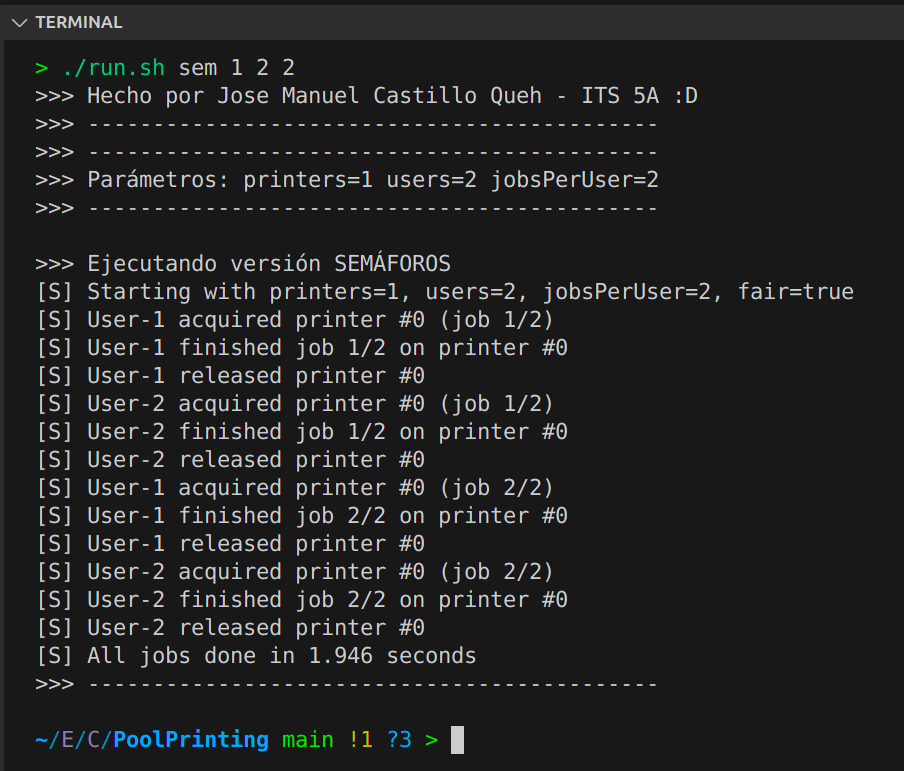
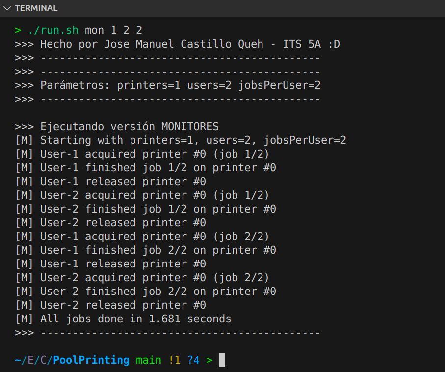

# Pool Printing (Printer Pool with Semaphores & Monitors)

*Proyecto de concurrencia con exclusión mutua usando semáforos y monitores en Java.  
Caso de estudio: Pool de impresoras (varias impresoras compartidas por muchos usuarios/hilos).*

> **Jose Manuel Castillo Queh - ITS 5A**

---

# Introducción al problema de la condición de carrera

En la programación concurrente, donde múltiples procesos o hilos se ejecutan de manera casi simultánea y comparten recursos comunes, surge un fenómeno crítico conocido como condición de carrera. Este problema aparece cuando dos o más hilos acceden y manipulan una misma variable o recurso compartido sin la debida sincronización, lo que provoca resultados inconsistentes o inesperados. El término “carrera” se refiere precisamente a la competencia entre hilos por acceder primero a la sección de código que modifica el recurso, lo cual depende del orden en que el sistema operativo planifique su ejecución. Dado que este orden es no determinista, el comportamiento del programa puede variar en cada ejecución, volviéndose difícil de prever y depurar.

Un ejemplo clásico se observa al incrementar un contador compartido. Si dos hilos leen el mismo valor inicial, lo incrementan y escriben el resultado, uno de los incrementos se pierde, generando un valor menor al esperado. Este tipo de fallos puede parecer trivial en un caso aislado, pero en sistemas complejos como bases de datos, servidores web o aplicaciones de tiempo real, las condiciones de carrera pueden derivar en corrupción de datos, caídas del sistema o vulnerabilidades de seguridad.

El problema se agrava en entornos donde los recursos son limitados y altamente demandados, como en el pool de impresoras. Sin medidas de control, varios hilos podrían asignarse la misma impresora, provocando colisiones de trabajos y estados inconsistentes. En este contexto, la importancia de la exclusión mutua y la sincronización se hace evidente, pues solo mediante mecanismos como semáforos o monitores es posible garantizar que los hilos colaboren de forma ordenada y segura.

--- 

# Explicación breve del funcionamiento de semáforos y monitores

En el ámbito de la programación concurrente, los semáforos y los monitores constituyen dos mecanismos fundamentales para garantizar la exclusión mutua y la correcta coordinación entre hilos que comparten recursos. Aunque ambos persiguen el mismo objetivo general, sus enfoques y nivel de abstracción presentan diferencias importantes.

El semáforo es una estructura de control introducida por Edsger Dijkstra en 1965. Consiste en una variable entera protegida que admite únicamente dos operaciones atómicas: wait (o P) y signal (o V). Un semáforo puede ser de dos tipos: binario, que actúa como un candado para asegurar que solo un hilo entre en la sección crítica, y contador, que modela un conjunto de recursos idénticos. Por ejemplo, en un sistema con varias impresoras, un semáforo contador puede representar cuántas están libres. Si el valor es mayor que cero, un hilo puede acceder y el contador se decrementa; si es cero, el hilo se bloquea hasta que otro libere el recurso con signal.

Los monitores, en cambio, son una abstracción de más alto nivel. Un monitor encapsula tanto los datos compartidos como los métodos que los manipulan, y asegura que únicamente un hilo ejecute dichos métodos a la vez. En lenguajes como Java, esto se implementa mediante la palabra clave synchronized y las operaciones wait, notify y notifyAll. Así, un hilo puede suspenderse hasta que una condición específica cambie, mientras que otros hilos pueden notificar esa modificación.

# Explicación del codigo fuente
### `src/semaphore/` (versión con semáforos)

#### `PrinterPoolSemaphore`
Gestiona el pool de impresoras usando:  
- Un **semáforo contador** para la disponibilidad (cuántas impresoras libres quedan).  
- Un **semáforo binario (mutex)** para la sección crítica de asignar/liberar una impresora concreta.  
Lógica: al adquirir, esperar en el contador (bloqueo si no hay libres) y elegir una impresora dentro del mutex. Al liberar, marcar libre en sección crítica y señalizar al contador para despertar a un hilo esperando.

#### `UserTaskSemaphore`
Simula a un **usuario/hilo** que envía varios trabajos. Para cada trabajo: adquiere impresora, imprime (tiempo simulado) y libera. Emite logs para registrar el comportamiento (evidencias).

#### `MainSemaphore`
Punto de entrada: lee parámetros, crea el pool y lanza hilos de usuarios. Espera a que todos terminen y resume la ejecución.

### `src/monitor/` (versión con monitores)

#### `PrinterPoolMonitor`
Implementa el pool con métodos `synchronized` (exclusión mutua implícita) y `wait/notifyAll` para coordinar espera/continuación. Si no hay impresoras, espera; al liberar una, notifica a los hilos bloqueados para que compitan de nuevo.

#### `UserTaskMonitor`
Un hilo que ejecuta varios trabajos análogos a la versión con semáforos: adquirir, imprimir, liberar y registrar en consola.

#### `MainMonitor`
Punto de entrada: lee parámetros, construye el pool, lanza hilos y sincroniza su finalización.

---

# Evidencias



# Conclusiones
La exclusión mutua es indispensable para mantener la consistencia del estado en aplicaciones concurrentes. En el patrón Printer Pool, sin sincronización, dos hilos podrían asignarse la misma impresora, corrompiendo el sistema y provocando fallas intermitentes difíciles de depurar.  

La versión con semáforos separa claramente las responsabilidades: el semáforo contador modela la disponibilidad de impresoras y el mutex binario protege las operaciones críticas. Esta solución ofrece gran control y puede afinarse con fairness para mitigar inanición.  

La versión con monitores (`synchronized` + `wait/notifyAll`) integra exclusión mutua y sincronización por condición dentro de una misma abstracción, favoreciendo un diseño más legible y mantenible. Aunque ambos enfoques resuelven el problema, los monitores suelen reducir la probabilidad de errores al encapsular la lógica de bloqueo.  

En definitiva, aplicar estas técnicas evita condiciones de carrera, mejora la predictibilidad y eleva la calidad del software concurrente.

> Nota: Lo siguiente información no pertenece en sí a las rúbricas requeridas pero son importantes para la documentación.
Att: José Manuel Castillo Queh

## Cómo compilar y ejecutar
Decidí agregar un método de ejecución sencillo con un solo script `run.sh` (en la raíz)

1.  Primero otorgamos permisos en nuestra terminal para ejecutar `.sh`
```bash
# Damos permisos
chmod +x run.sh
./run.sh
```

2. Ya con lo anterior ya podemos ejecutar lo siguiente:

```bash
./run.sh sem 1 6 4 # Para semáforo

./run.sh mon 1 6 4 # Para monitor

./run.sh both 1 6 4 # Para ejecutar ambos
```
---

## Parámetros de ejecución

| Parámetro | Significado | Ejemplo |
|---|---|---|
| `printers` | Número de **impresoras** en el pool (recursos disponibles). | `3` |
| `users` | Número de **usuarios/hilos** que compiten por imprimir. | `6` |
| `jobsPerUser` | Cantidad de **trabajos** que enviará cada usuario. | `4` |